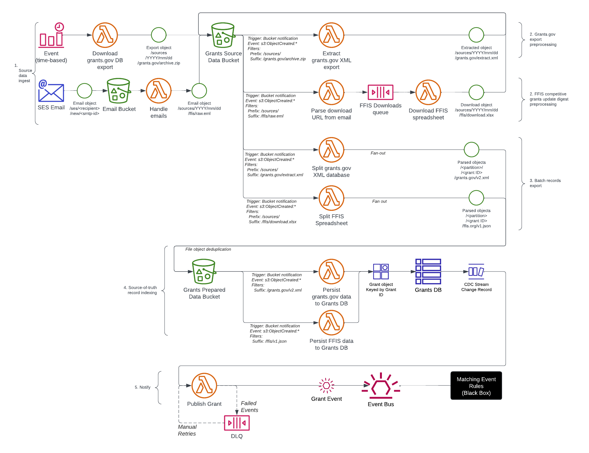

# Grants Ingest Service

Ingests and indexes data related to grants.


## What's this?

This repository contains both IaC (terraform) and runtime code for the Grants Ingest pipeline
service. The purpose of this service is to collect information about grant opportunities from
third party sources, such as [Grants.gov](https://grants.gov), and organize that data into
per-grant data records that can be consumed whenever updates to the underlying data occur.


## Architecture

This service consists of an event-driven pipeline that uses AWS Lambda for running various
compute tasks. Additionally, Amazon S3 is used for archival storage of raw source data, while
DynamoDB provides an active index of processed grant opportunity records. At the end of the ingestion
pipeline, newly-created/-updated grant opportunity records are sent to an event bus that delivers
the updates to subscribers.

<details>
  <summary>High-level architecture</summary>
  
</details>
<details>
  <summary>Component-level architecture</summary>
  
</details>


## Code Organization

Code for this service can generally be considered under two categories:


### IaC

Infrastructure-as-code (IaC) used to provision the target environment, which is written
with Terraform, and normally run during deployment. The main Terraform project is located in
this directory; infrastructure specific to a particular step in the pipeline is organized into
Terraform modules located within the `modules` subdirectory.


### Runtime

Runtime code that executes (e.g. by AWS Lambda) within the target environment in response to
some triggering event. Runtime code is written using Go (currently targeting version `1.20.x`),
which is organized in the repository root directory according to the following conventions:

- `cmd/`: This directory contains one subdirectory per Lambda function, and should provide a single
`main` package that can be compiled into a per-function binary. Each subdirectory of `cmd`
should have a name that obviously aligns with the particular Lambda function for which it is
written (which generally should correspond to the Terraform module directory used to provision
the Lambda function and its dependencies). For example:
  - Lambda handler code: `cmd/DownloadGrantsGovDB`
  - Terraform module: `modules/DownloadGrantsGovDB`
- `pkg/`: This directory contains "library code" used by one or more Lambda functions in the project,
organized into per-package subdirectories according to Go convention.
- `internal/`: This directory is similar to `pkg/` but contains packages that are only intended
to ever be used internally by this project and make no guarantees about third-party compatibility.
Generally, reusable libraries providing common functionality used by multiple Lambda functions
should reside here.


## Development

During development, infrastructure and runtime code can be tested by configuring Terraform
to target an actual ("sandbox", dedicated for development) AWS environment or a mock AWS
environment simulated with [LocalStack](https://localstack.cloud/) if an AWS sandbox environment
is unavailable.


### Configuring Terraform and LocalStack


#### Prerequisites

To begin, make sure the following tools are available in your development workspace:
- [Go](https://go.dev/)
  - Ensure you're using the version found in [go.mod](https://github.com/usdigitalresponse/grants-ingest/blob/main/go.mod)
  - If you need to manage multiple Go versions on your machine, you can follow [official guidance](https://go.dev/doc/manage-install)
    or use a tool like [asdf](https://github.com/asdf-vm/asdf), [gvm](https://github.com/moovweb/gvm), or [goenv](https://github.com/go-nv/goenv)
- [AWS CLI v2](https://docs.aws.amazon.com/cli/latest/userguide/getting-started-install.html)
- [Terraform](https://developer.hashicorp.com/terraform/downloads)
  - Download the version found in [.terraform-version](https://github.com/usdigitalresponse/grants-ingest/blob/main/terraform/.terraform-version)
- [LocalStack](https://docs.localstack.cloud/getting-started/installation)
- [tflocal](https://github.com/localstack/terraform-local)
- [awslocal](https://github.com/localstack/awscli-local)
- [tfenv](https://github.com/tfutils/tfenv) *Optional, but recommended.*

**Note:** This document assumes usage of [Docker-Compose method](https://docs.localstack.cloud/getting-started/installation/#docker-compose).
However, you can choose whatever LocalStack installation option best suits your environment.


> [!TIP]
> Check that you have the necessary dependencies for LocalStack development by running `task local:check-dependencies`


#### Environment Variables

We recommend setting the following environment variables in your development workspace when working
with LocalStack:

- `AWS_SDK_LOAD_CONFIG=true`
- `AWS_REGION=us-west-2`
- `AWS_DEFAULT_REGION=us-west-2`
- `AWS_ACCESS_KEY_ID=testing`
- `AWS_SECRET_ACCESS_KEY=testing`
- `LOCALSTACK_VOLUME_DIR`
    - Should be set to whatever path you want to persist LocalStack data.
    If not set, the default behavior is to target a `./volume` subdirectory
    from where `docker compose` is run.


#### Provisioning Infrastructure

#### Quickstart

Certain steps described in the "Manual Provisioning" section below may be achieved using the following
shortcut commands provided by this repository's Taskfile:
- **Prerequisite:** Ensure LocalStack is started by running `docker compose up -d`
- **Deploy to LocalStack for the first time:** `task local:from-scratch`
- **Subsequent deployments to LocalStack:** `task local:deploy`
- **Invoke the `DownloadGrantsGovDB` Lambda function:** `task local:invoke-DownloadGrantsGovDB`

See `.taskfile/local.yml` for more information and other shortcuts.


#### Manual Provisioning

After starting LocalStack, create a terraform state deployment bucket in the localstack environment.  This guide, as well as the provided Terraform backend file for local development, assumes that
this bucket is named `local-terraform` and has a region of `us-west-2`.

To create this bucket, navigate to the terraform folder, then run the following command:
```bash
awslocal s3 mb s3://local-terraform
```
If using the provided [docker-compose](https://github.com/usdigitalresponse/grants-ingest/blob/cf8a6220ed4e7332978520ec1d63bb344b738972/docker-compose.yml#L21)
then this runs when the localstack container is started.

Next, initialize the Terraform project using the `local.s3.tfbackend` Terraform state backend
configuration file provided by this repository. Note that you may need to modify the `endpoint`
setting in this file if your LocalStack environment uses a different host/port other than the
default of `localhost:4566`.

```bash
tflocal init -backend-config="local.s3.tfbackend" -reconfigure
```

Once this command completes successfully, use `tflocal` to "provision" mock infrastructure in your LocalStack environment.  This will create the Lambda functions, so it requires the functions to be
built first.  Use `task build` to build the functions.  Then use the `local.tfvars` file provided by this
repository to provision the mock infrastructure:
```bash
tflocal apply -var-file=local.tfvars
```

**Hint:** It's normal for `task build` and/or `tflocal apply` to run for up to a few minutes.
If you notice that these commands are taking an excessively long time or seem to hang, try
cancelling the operation, then run `task prebuild-lambda` and try running your command again.


#### Running Lambda Functions

Once your Lambda function has been deployed to your running LocalStack environment, you can
invoke it in order to test its execution and observe log output. Since each Lambda function
behaves differently and expects different inputs, the exact nature of the debugging cycle
will vary between functions. However, the following example demonstrating invocation of the
function defined in `module.DownloadGrantsGovDB` may be used as a starting point.

In general, Lambda functions are invoked with a JSON payload that represents the `event`
input expected by the Lambda handler. Again, the structure of this payload varies depending
on the invocation source(s) configured for each Lambda function. In the case of the Lambda
function defined in `module.DownloadGrantsGovDB`, the expected payload is a JSON object
containing a `"timestamp"` key whose value is an ISO-8601 timestamp string, from which
the date of a desired Grants.gov database export is derived. For example:

```json
{"timestamp": "2023-03-20T05:00:00-04:00"}
```

When using `awslocal` (or the official AWS CLI, for that matter), also note that the payload
must be provided as a Base64-encoded encoded representation of the payload. The following example
demonstrates an invocation of a Lambda function named `grants-ingest-DownloadGrantsGovDB`
that provides the above example JSON in Base64 encoding and prints the Lambda output to stdout:

```bash
awslocal lambda invoke \
    --function-name grants-ingest-DownloadGrantsGovDB \
    --payload $(printf '{"timestamp": "2023-03-20T05:00:00-04:00"}' | base64) \
    /dev/stdout
null
{
    "StatusCode": 200,
    "LogResult": "",
    "ExecutedVersion": "$LATEST"
}
```

The above output displays the Lambda function invocation result following its successful execution;
the output you see will vary depending on the input, the function version that was invoked,
whether an unhandled error cause execution to fail, etc.

In order to view execution logs outputted during Lambda invocation, use CloudWatch Logs (just as
you would when conducting tests against a genuine AWS environment). The following command can
be used to observe log output in real-time:

```bash
awslocal logs tail /aws/lambda/grants-ingest-DownloadGrantsGovDB --follow
```

When actively debugging, it is useful to run a command similar to the above in a separate terminal
prior to invoking the Lambda function under test, as it only displays logs emitted after the
`awslocal logs tail` started. You can use the `--since` option (with or without `--follow`)
in order to display historical logs from previous invocations. For example, the following command
shows logs emitted in the past 1 hour, and will continue to display new logs as they are emitted:

```bash
awslocal logs tail /aws/lambda/grants-ingest-DownloadGrantsGovDB --since 1h --follow
```

### Running Common Tasks

This repository provides a `Taskfile.yml` file for defining and running common tasks related
to development. You can [install the `task` utility](https://taskfile.dev/installation/)
and then run `task` in your command-line environment to see a list of the available helpers.


### Go compiler architecture

This project is configured to target ARM64 CPU architecture when building Go binaries,
since that is what we run on staging and production.
Some contributors who develop on 64-bit Intel machines may have issues running Lambdas on LocalStack with this configuration.
Currently, the suggested workaround is to make the following modifications to target 64-bit Intel when building locally and deploying to LocalStack:

- In `Taskfile.yml`, modify the `go-build-lambda` task's command to set `GOARCH=amd64` (replaces `GOARCH=arm64`).
- In `terraform/local.tfvars`, add the following Terraform input variable: `lambda_arch = "x86_64"`.


#### Quick Reference

The following items can be referred to as a quick "cheat-sheet" for development:
- Install Go dependencies: `go mod download` or `go get ./...`
- Run Go unit tests: `task test`
- Ensure all Go and Terraform code is formatted properly: `task fmt`
- Warm up your Go cache: `task prebuild-lambda`
  - We recommend running this command periodically, especially before compiling Go binaries,
  running `tflocal plan`, and/or `tflocal apply`.
- Compile binary Lambda function handlers: `task build`
- Compile the CLI tool: `task build-cli`
- Run all QA checks normally executed during CI: `task check`
- Initialize and deploy a test environment after starting LocalStack: `task local:from-scratch`


## Contributing

This project wouldn’t exist without the hard work of
[many people](https://github.com/usdigitalresponse/grants-ingest/graphs/contributors)! Please
see [CONTRIBUTING.md](https://github.com/usdigitalresponse/grants-ingest/blob/main/CONTRIBUTING.md)
to find out how you can help.


## Releasing to Production

**Note:** Releases are versioned using a `YYYY.inc` scheme that represents the year of the
release, and the incremental release number for that year. You can view a list of all historical
releases on the [Releases page](https://github.com/usdigitalresponse/grants-ingest/releases).

Maintainers with the requisite access may release to Production by performing the following
steps:
1. Navigate to the [list of Releases](https://github.com/usdigitalresponse/grants-ingest/releases)
for this repository.
2. Locate the draft for the next release, and click the pencil icon to edit.
3. Provide a high-level summary of the release in the **Summary** section of the release notes.
4. Optionally, make any necessary edits to the other sections of the prepared release notes.
5. Ensure "Set as a pre-release" is checked at the bottom of the edit page.
6. Click the "Publish Release" button.

At this point, the release will be published (as a pre-release) and the
[deployment pipeline](https://github.com/usdigitalresponse/grants-ingest/actions/workflows/deploy-production.yml)
will automatically begin preparing the changes that will be rolled out to Production.

Once a Terraform plan has been created for the release, repository administrators will be notified
for review and final approval. After the plan has been approved and applied to Production,
the release will be automatically updated to remove the pre-release state, and a timestamp
for the deployment will be appended to the release notes.
